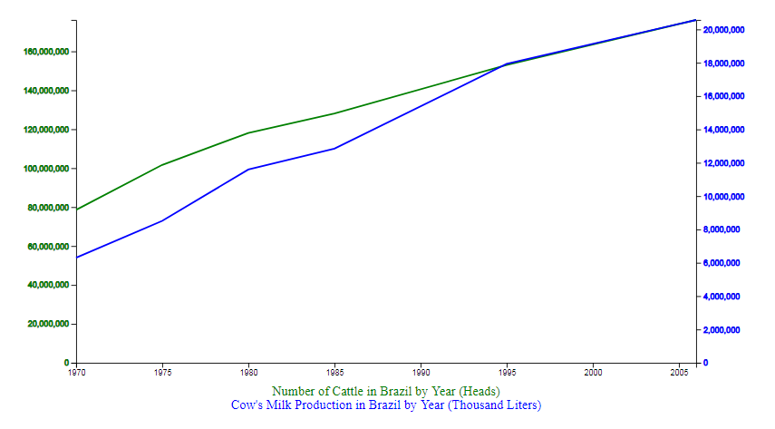

# Project 2 Report
## Amazon/Brazil??? Fires and Deforestation

#### Authors
* Alexander Burch
* Ian Rao
* Trevor Sauerbrey
* Ivy Tiongco

#### Project Description

We analyzed fires and deforestation in Brazil, using a Python Flask–powered RESTful API, HTML/CSS, JavaScript, MongoDB, Chartist JS Libary (not covered in class), and deployed to Github Pages. 

Project Proposal
URL: https://docs.google.com/presentation/d/16SSofyuzxMUWQbZseCeCK2TuT39yF9r5JsHjvHAqZDM/edit?usp=sharing

## Datasets
* Brazil Fires Data (2100+ records)
  * Org
  * Link  
* Brazil Deforestation Data
  * Org
  * Link  
* Cattle Data
  * IBGE - Brazilian Institute of Geography and Statistics
  * https://sidra.ibge.gov.br/acervo#/S/CA/A/40/T/Q

## Visualizations
* Heatmap
  * SCREENSHOT  
* State map
  * SCREENSHOT  
* Bar/line graph
  * Using Chartist, a JS library not covered in class
  * Includes user-driven interaction - tooltip???
  * SCREENSHOT  
* Multiline/multiaxis line graph
  * 

* Create Github Pages webpage displaying all visualizations
  * https://ivytiongco.github.io/project2-amazon-fires/
