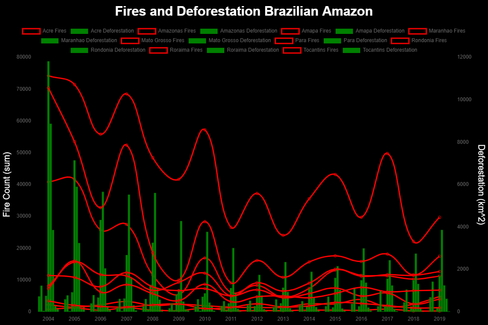
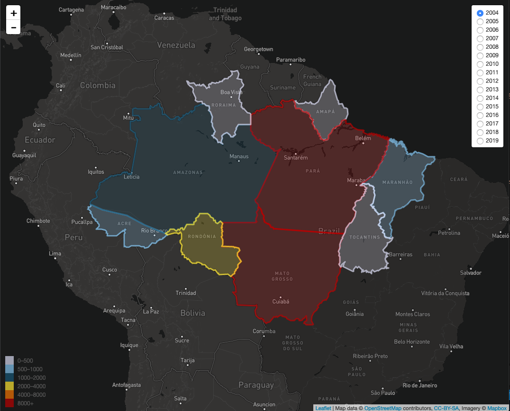
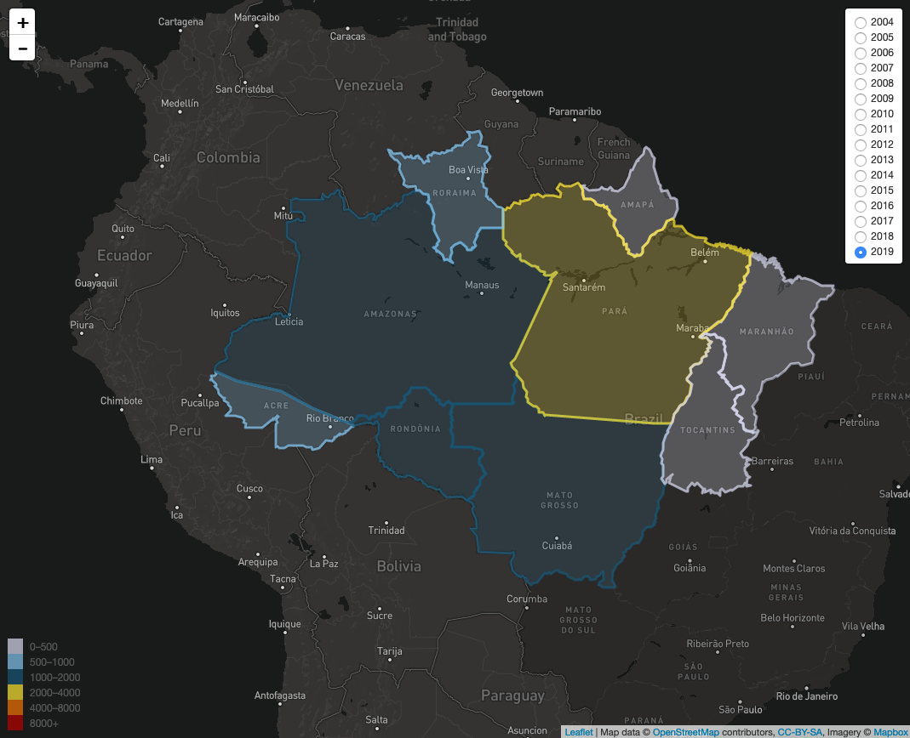
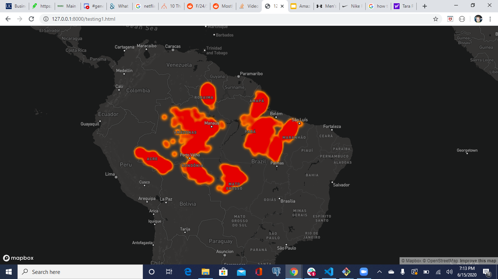
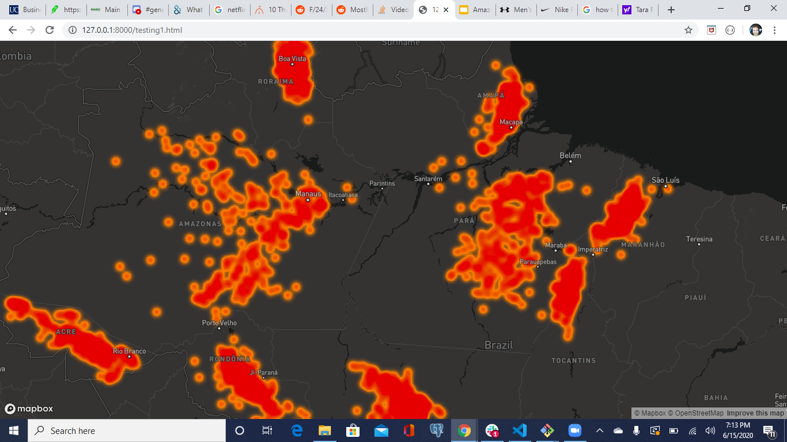
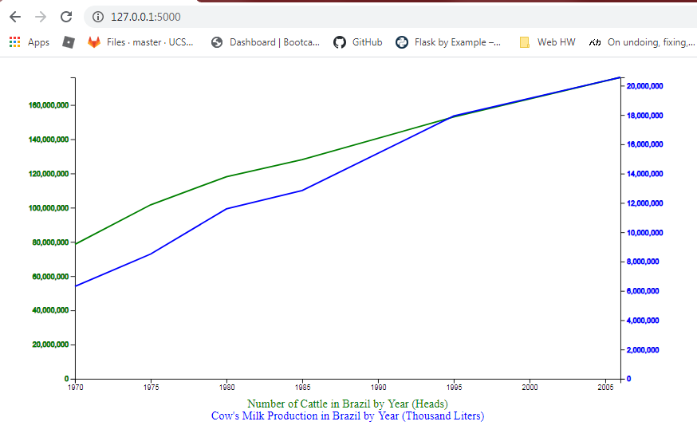

# Project 2 Report
## Brazil Fires and Deforestation

#### Authors
* Alexander Burch
* Ian Rao
* Trevor Sauerbrey
* Ivy Tiongco

#### Project Description

We analyzed fires and deforestation in Brazil, using a Python Flask–powered RESTful API, HTML/CSS, JavaScript, Leaflet, Mapbox, and MongoDB. Our project track is a custom “creative” D3.js project (i.e., a nonstandard graph or chart), including user-driven interaction (click to change data displayed) and we chose Chart.js to fulfill the requirements of using a JS Libary not covered in class.

#### GitHub Pages Website
  * https://ivytiongco.github.io/project2-amazon-fires/
  
Project Proposal

URL: https://docs.google.com/presentation/d/16SSofyuzxMUWQbZseCeCK2TuT39yF9r5JsHjvHAqZDM/edit?usp=sharing

Project Presentation

Presentation slides in PDF format are included in this repo.

## Datasets
* Brazil Fires Data (2100+ records)
  * Kaggle - Forest Fires in Brazil
  * https://www.kaggle.com/gustavomodelli/forest-fires-in-brazil  
* Brazil Deforestation Data
  * Kaggle - Brazilian Amazon Rainforest Degradation 1999-2019
  * https://www.kaggle.com/mbogernetto/brazilian-amazon-rainforest-degradation
* Beef Exports (Brazil) 
  * MDIC, SECEX, Abiec
  * https://www.globalmeatnews.com/Article/2019/01/22/Largest-ever-beef-exports-by-volume-for-Brazil
* GDP and CO2 Emissions (Brazil) 
  * World Bank
  * https://data.worldbank.org/country/brazil
* Cattle Data
  * IBGE - Brazilian Institute of Geography and Statistics
  * https://sidra.ibge.gov.br/acervo#/S/CA/A/40/T/Q

## Visualizations
* Bar/line chart of of Brazil fire and deforestation (index_TS.html)
  * Using Chart.js, a JS library not covered in class
  * Includes user-driven interaction (click to change data displayed)

* Line chart of Brazil fires, deforestation, CO2 emissions, GDP, and beef exports (index3_TS.html)
  * Using Chart.js, a JS library not covered in class
  * Includes user-driven interaction (click to change data displayed)
  

* Map of deforestation in Brazil states (alex/index.html)
  * Includes user-driven interaction (click to change data displayed)

* Heatmap of Brazil fires (testing1.html)

  

 

* Multiline/multiaxis line graph of Brazil cattle data (app.py)
  * Using JSON data from Python Flask–powered RESTful API & MongoDB

